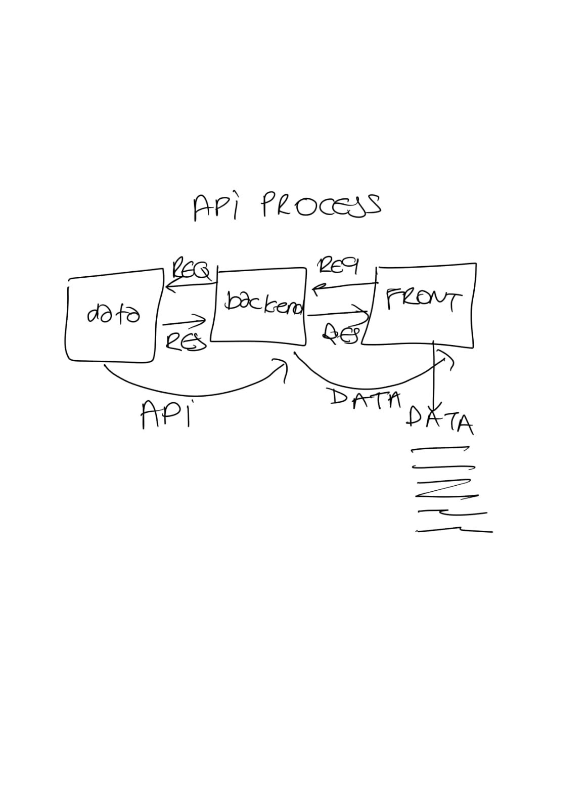

### Hello everyone, in this article I would like to tell you about my project and which libraries I need about my project. And I want to give information about the built structure.

### Library

- axios
- react-router-dom

## Axios Api

### Is Axios a REST API? Axios is an HTTP client library based on promises. It makes sending asynchronous HTTP requests to REST endpoints easier and helps you perform CRUD operations. This REST endpoint/API could be an external API like the Google API, GitHub API, and so on – or it could be your own backend Node

[axios link](https://axios-http.com/docs/intro)

## React-router-dom

### React Router DOM is an npm package that enables you to implement dynamic routing in a web app. It allows you to display pages and allow users to navigate them. It is a fully-featured client and server-side routing library for React

## React-router-dom and routing


https://user-images.githubusercontent.com/81258778/189355886-f5501da9-f64d-4725-8db8-88ea97498880.mp4


### What is Components ?

### Components are independent and reusable bits of code. They serve the same purpose as JavaScript functions, but work in isolation and return HTML. Components come in two types, Class components and Function components, in this tutorial we will concentrate on Function components.

### Why do we use component in React?

### A Component is one of the core building blocks of React. In other words, we can say that every application you will develop in React will be made up of pieces called components. Components make the task of building UIs much easier.


https://user-images.githubusercontent.com/81258778/189356243-8b44b26d-4418-4cdb-b2e5-7b2d1fd6d46a.mp4


## Life cycle events

### Adding

- consturctor
- render
- componentDidMount

### Update

- render
- componentDidUpdate

### Remove

- componentWillUnmount

### Http Request

- GET , POST

### axios library and api process

- Open Terminal

```js
npm install axios
```

### After the download is complete and open the app.js file this is "import axios from 'axios'" you typed .

```js
import axios from 'axios'
```



```js
import React, { Component } from 'react'
import CountryCard from './CountryCard'
import axios from 'axios'
export default class Countries extends Component {
  state = {
    countries: [],
    errorMessage: '',
  }
  componentDidMount() {
    axios
      .get('https://restcountries.com/v3.1/all')
      .then((res) => {
        if (res) {
          this.setState({
            countries: res.data.slice(0, 20),
          })
        }
      })
      .catch((err) => {
        this.setState({ errorMessage: err.message })
      })
  }
  searchHandler = (e) => {
    let country = e.target.value
    axios.get('https://restcountries.com/v3.1/name/' + country).then((res) => {
      this.setState({
        countries: res.data,
      })
      console.log(res)
    })
  }
  render() {
    const countryList = this.state.countries.map((dat, idx) => {
      return (
        <>
          <CountryCard dat={dat} key={idx} />
        </>
      )
    })
    return (
      <>
        <div className="input">
          <input
            type="text"
            className="inputtext"
            onChange={this.searchHandler}
            placeholder={'country search'}
          />
        </div>
        {this.state.countries.length === 0 ? (
          <div className="countrList">{this.state.errorMessage}</div>
        ) : (
          <div className="countryList">{countryList}</div>
        )}
      </>
    )
  }
}
```

## Information About the Project


### My project is countries project, I pulled the data I got from [restcountries](https://restcountries.com/) using axios api and showed it on the front side. In the search part, I applied the api operation again. and I showed about general information of countries using axios api. My purpose in this project;

- axios api tutorial
- react-router-dom tutorial
- lifecycle
- orientation
- fully understand and explain the class structure and function structure
- state and props
- components

### Thank you for taking the time to read this article, have a nice day.

### => Ayhan Daşyuvarlar
